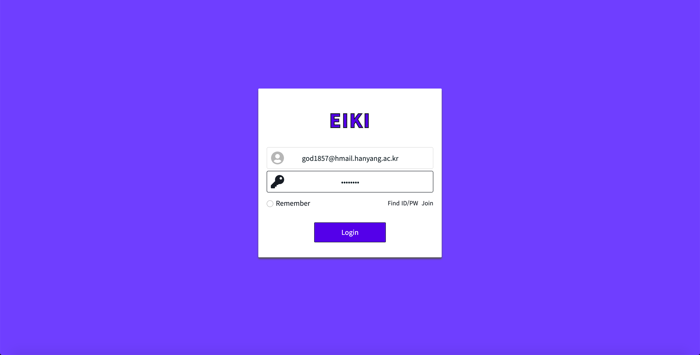
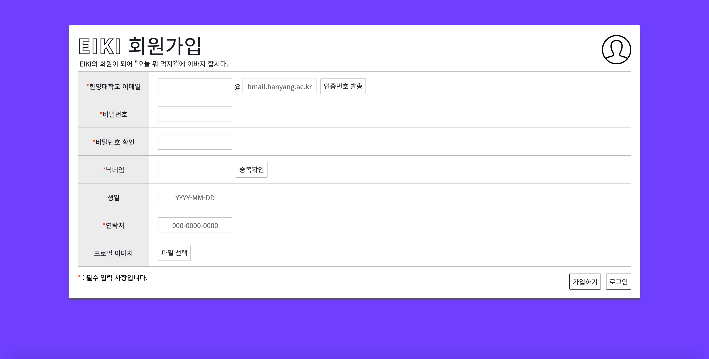
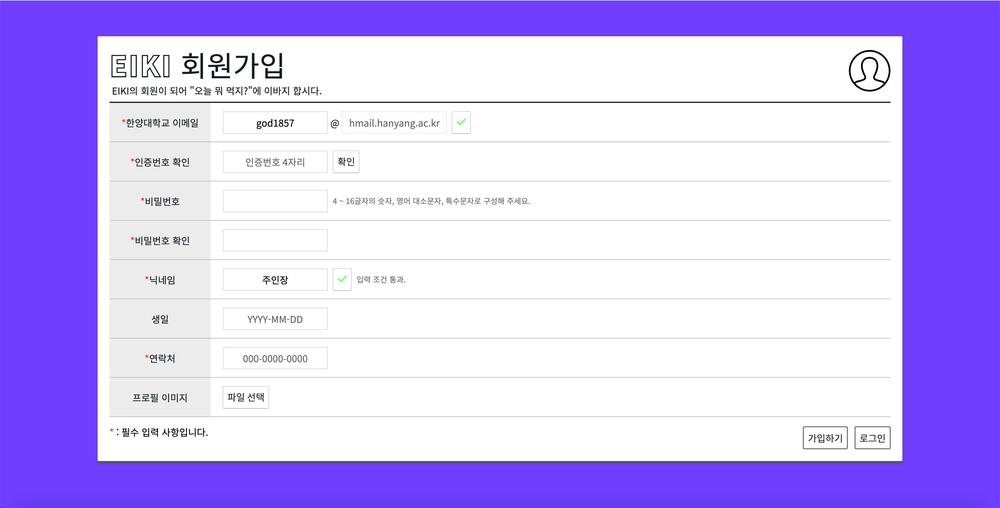

# [Spring-MVC] EIKI - ERICA Food WiKi

## 프로젝트 목적

- 우리학교 학생들에게 학교 앞 근처 상가에 존재하는 음식점들의 정보(가격, 배달 유무, 선호도) 제공
- 커뮤니티 기능 도입을 통한 음식 사진, 개개인의 후기 공유

## Tech Stack

| Frontend | Backend | Database | VCS |
|:--------:|:--------:|:-------:|:-------:|
| `HTML5` | `JAVA` | `MYSQL` | `GIT` |
| `CSS3` | `SPRING-MVC` |  |
| `JAVASCRIPT(ES6)` | `DOCKER`  | |

## Dev Images

| LOGIN | LOGIN2 |
|:--------:|:--------:|
|||

| JOIN | JOIN2 |
|:--------:|:--------:|
|||