# [Spring-MVC] EIKI - ERICA Food WiKi

## 프로젝트 목적

- 우리학교 학생들에게 학교 앞 근처 상가에 존재하는 음식점들의 정보(가격, 배달 유무, 선호도) 제공
- 커뮤니티 기능 도입을 통한 음식 사진, 개개인의 후기 공유

## Tech Stack

| Frontend | Backend | Database | VCS |
|:--------:|:--------:|:-------:|:-------:|
| `HTML5` | `JAVA` | `MYSQL` | `GIT` |
| `CSS3` | `SPRING-MVC` |  |
| `JAVASCRIPT(ES6)` | `DOCKER`  | |

## Dev Images

| LOGIN | LOGIN2 |
|:--------:|:--------:|
|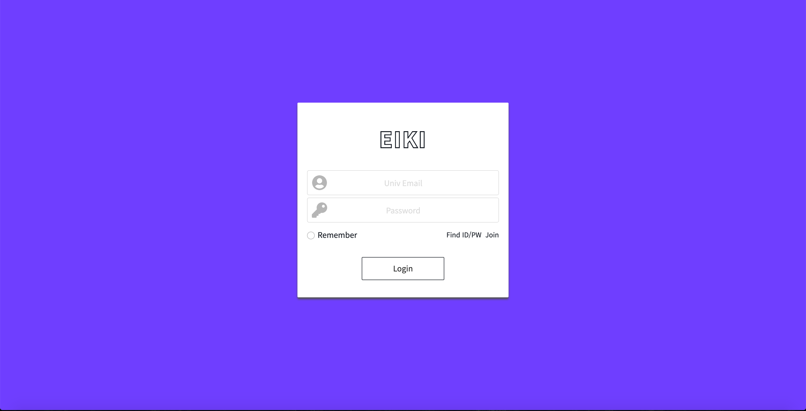|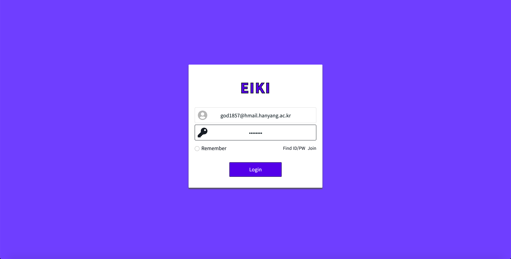|

| JOIN | JOIN2 |
|:--------:|:--------:|
|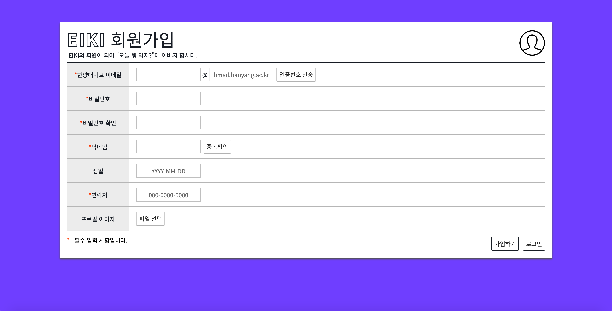|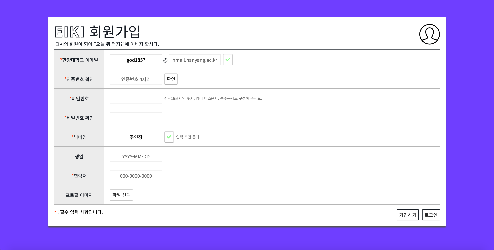|

| INFO | INFO2 |
|:--------:|:--------:|
|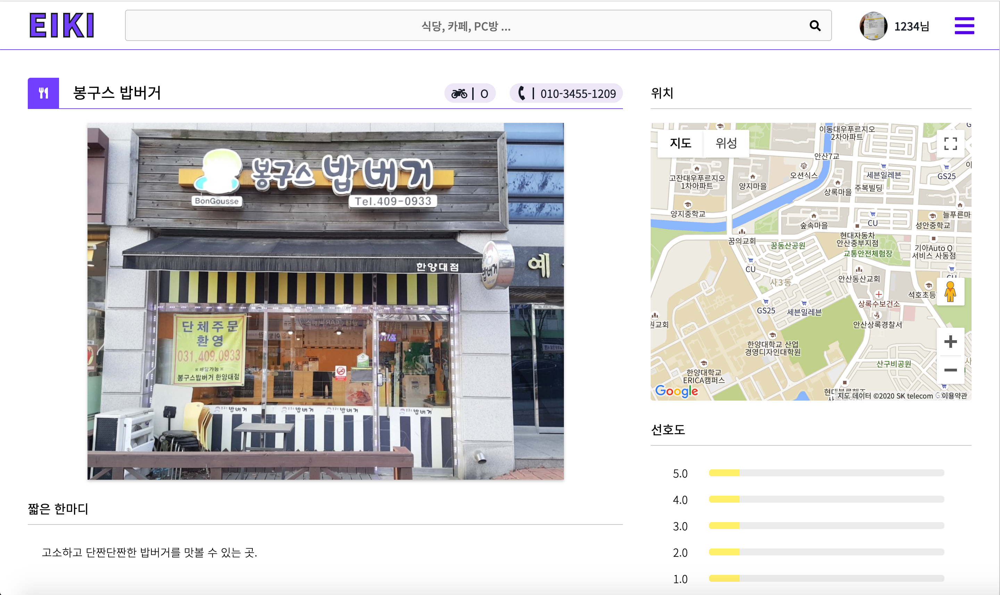||

| REVIEW | HOME |
|:--------:|:--------:|
|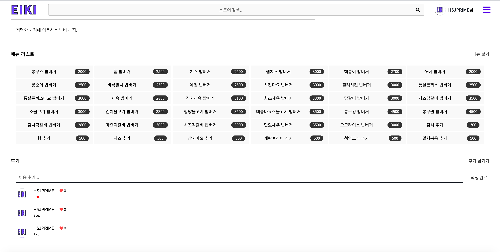|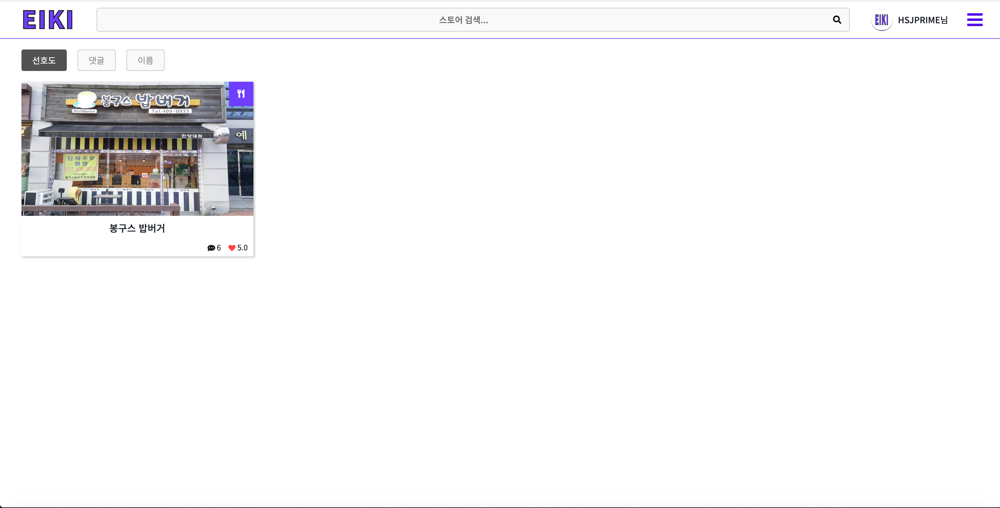|

| POST | POST2 |
|:--------:|:--------:|
|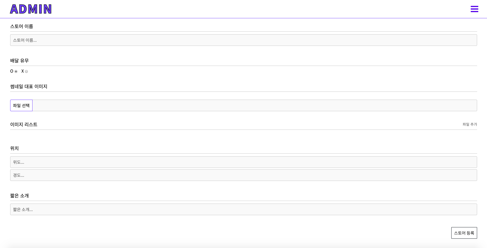|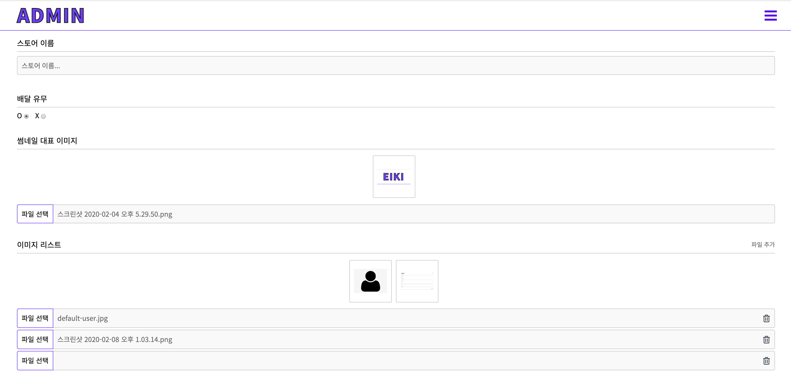|

| MEMBER_MANAGE | COMMENT_MANAGE |
|:--------:|:--------:|
|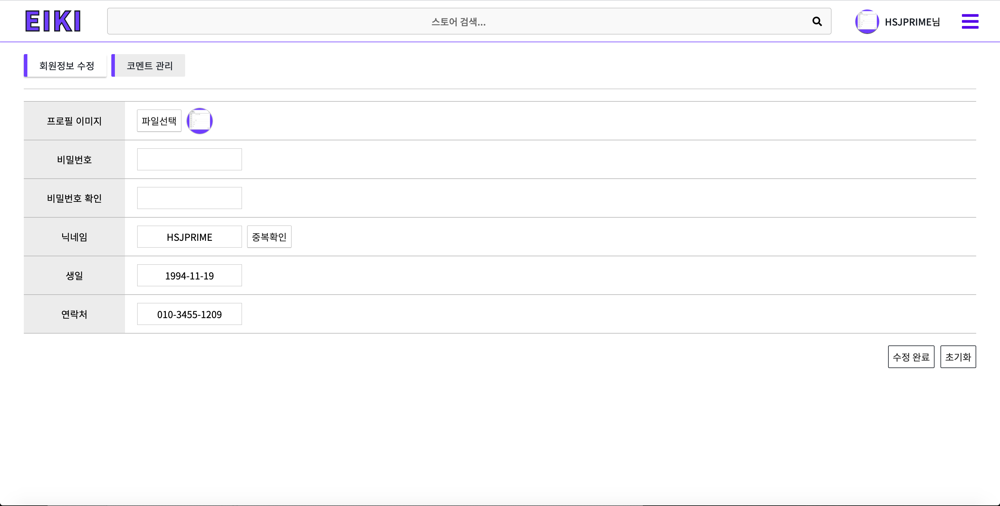|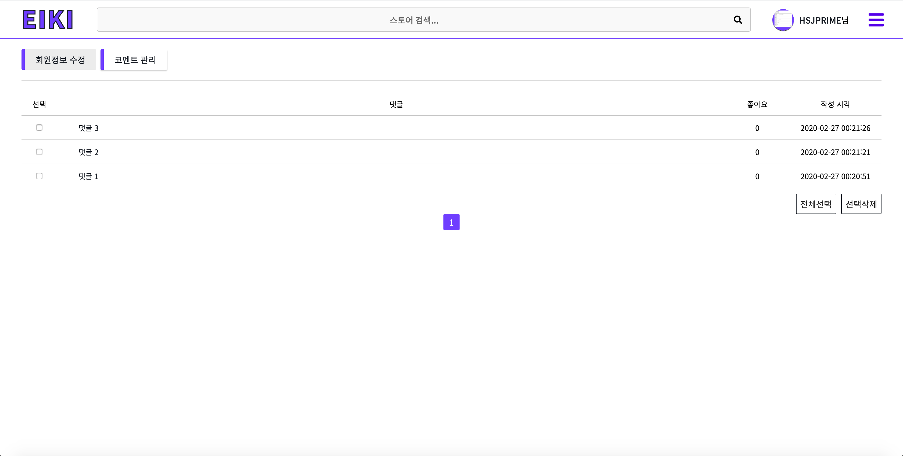|

| STORE_SEARCH | STORE_EDIT |
|:--------:|:--------:|
|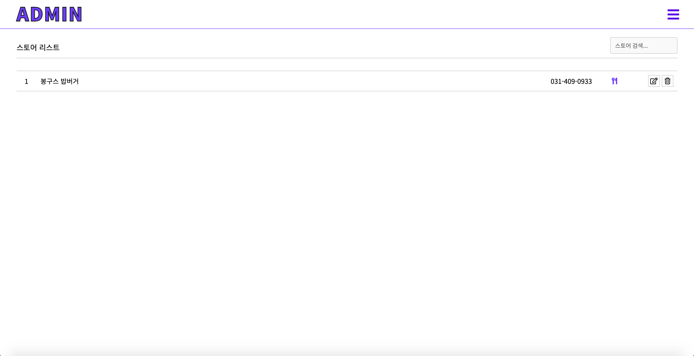|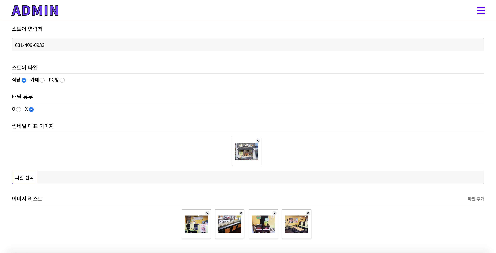|

| STORE_EDIT2 | STORE_EDIT2 |
|:--------:|:--------:|
|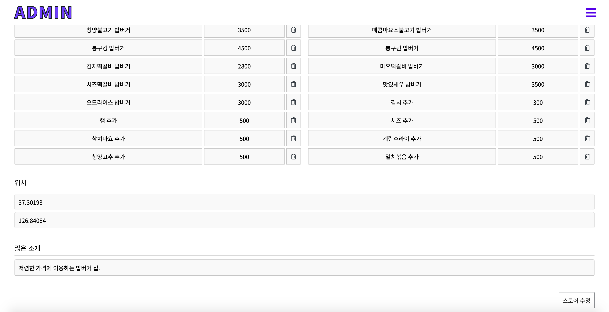||
## Dev History

### 2020.01.29

- 개발 내용

    - 회원가입 혹은 로그인 성공시 세션이 발행된 상태로 `/eiki/home`으로 이동.
    
    - `SessionCheckInterceptor`통해 실제 서비스가 이루어지는 `/eiki` 하위 URL에 접근시 인터셉터는 지속적으로 세션 유효성 검사.
    
    - `/` 하위는 `login`, `join`, `find` 가 존재하는데 이는 세션과는 관련이 없으므로 지속적으로 세션 정보를 삭제.
    
- 개발 예정

    - 로그인 실패시 페이지 전환없이 에러 메시지를 출력해 주어야 하는데 `form` 태그 대신 `ajax` 콜로 대체.
    
    - `/eiki/home` 페이지 세션 유저 정보 반영하여 퍼블리싱
    
### 2020.01.30

- 개발 내용

    - JSTL 도입 
    
        - `<c:url />` 태그를 통한 컨텍스트 경로 반영
        
        - `<c:import />` 태그를 통한 JSP View 컴포넌트화
    
    - 로그인(`/auth/login`) 결과를 boolean으로 반환하고 클라이언트에서 라우팅
        
    - `/eiki/` 경로 하위 JSP View에 공통적으로 임포트 되어 사용되는 `topbar.jsp` 작성
    
- 개발 예정

    - 학교 근처 식당, 카페, PC방에서 제공되는 데이터 수집 (배달 유무, 메뉴, 가격, 외부 이미지, 내부 이미지 등)
    
    - 데이터베이스 모델 설계
    
    - `/eiki/home` 뷰 레이아웃 설계
    
### 2020.02.05

- 개발 내용

    - `/eiki/store/{store_idx}` 뷰 작성
    
    - 샘플 데이터 수집
    
    - 데이터베이스 DDL 작성 ([미완성](https://github.com/HamSungJun/EIKI/blob/master/sql/EIKI_DDL.sql))
    
- 개발 예정

    - 데이터 생성 페이지가 필요할 것 같다 ... (어드민 페이지)
    
        1. 데이터 생성 페이지 작성
        
        2. 데이터 삽입
        
        3. 데이터 기반으로 뷰 작성 및 렌더링
        
### 2020.02.09

- 개발 내용

    - 어드민 페이지 작성 (`/eiki/admin/*`)
    
    - 유저 테이블의 `IS_ADMIN`값을 세션값으로 부터 읽어 조건부 렌더링
    
    - 스토어 등록 페이지 작성 (`/eiki/admin/post`)
    
- 개발 예정

    - 스토어 등록 폼 데이터 스토리지(파일) 및 데이터베이스(텍스트)에 저장.
    
    - 스토어 등록 데이터 쿼리 후 `/eiki/home` 에 리스팅.
    
    - 리스트 아이템 클릭시 `/eiki/store/{store_idx}`로 라우팅.
    
### 2020.02.11

- 개발 내용

    - 스토어 메뉴 기능 추가
    
    - `UtilMethod` 클래스로 공통 메소드 분리
    
    - `EIKI_STORE_COMMENT` 테이블 추가
    
- 개발 예정

    - 개발 내용에 대한 예외 처리 및 테스트
    
### 2020.02.12

- 개발 내용

    - `NamedJdbcTemplate` 도입
    
    - 데이터베이스 스키마 수정 및 보완
    
    - 선호도 선택 인터페이스 및 기능 추가
    
    - 스토어 메뉴 리스트 등록 및 뷰 추가
    
    - `store.jsp` 페이지 데이터 베이스 연동
    
- 개발 예정

    - Comment 인터페이스 기능 개발

    - 예외 처리 및 오류 핸들
    
### 2020.02.17

- 개발 내용

    - `EIKI_COMMENT_PREFERENCE_HISTORY` 테이블 추가
    
    - 유저가 좋아요를 누른 기록이 있을 경우 삭제, 카운트 - 1
    
    - 유저가 좋아요를 누른 기록이 없을 경우 생성, 카운트 + 1
    
    - 좋아요 기능 호출은 비동기 요청으로 개발하고 응답은 새로운 댓글 리스트 데이터로 반환
    
    - 새로운 댓글 리스트 데이터를 기반으로 하단 후기 리스트를 리렌더링
    
- 개발 예정

    - 스토어 테이블 코멘트 갯수 동기화 작업
    
    - 자신의 댓글이면 삭제 할 수 있도록 만들기
    
    - js파일과 jsp스크립트 분리를 위해 데이터 값을 DOM data-property에 삽입할 생각...
    
### 2020.02.27

- 개발 내용 [(중간배포)](http://ec2-13-124-248-90.ap-northeast-2.compute.amazonaws.com/)
    
    - 배포 해보느라고 애좀 먹었다 ...
    
    - 마이페이지 개발 (회원정보 수정, 스토어 코멘트 관리)
    
    - 회원정보 수정
    
        - 회원 정보 업데이트 기능
    
    - 스토어 코멘트 관리
    
        - 작성한 코멘트를 최근 작성한 순으로 조회 + 페이지 네이션
        
    - AWS EC2
    
        - Docker 설치
        
        - 작업하던 데이터베이스 컨테이너 허브에 Push , EC2에서 Pull
        
        - OpenJDK 1.8 설치
        
        - Tomcat 설치
        
        ```bash
        
          # AWS EC2에 도커 소프트웨어 설치
          sudo apt update;
          sudo apt remove docker docker-engine docker.io containerd runc;
          sudo apt-get install \
              apt-transport-https \
              ca-certificates \
              curl \
              gnupg-agent \
              software-properties-common;
          
          curl -fsSL https://download.docker.com/linux/ubuntu/gpg | sudo apt-key add -;
          sudo apt-key fingerprint 0EBFCD88;
          
          sudo add-apt-repository \
             "deb [arch=amd64] https://download.docker.com/linux/ubuntu \
             $(lsb_release -cs) \
             stable";
          
          sudo apt-get update;
          sudo apt-get install docker-ce docker-ce-cli containerd.io;
          
          sudo docker run hello-world;
          
          # 작업하던 로컬 환경에서 컨테이너를 커밋 후 이미지로 도커 허브에 푸시
          docker commit <WORKING_CONTAINER> <IMAGE_NAME>
          docker login
          username : hsjprime
          password : ***
          
          docker tag mysql8 <USERNAME>/<IMAGE_NAME>
          docker push <USERNAME>/<IMAGE_NAME>
          
          # AWS EC2 에서 해당 이미지를 내려 받기
          docker pull <USERNAME>/<IMAGE_NAME>
          docker run --name <CONTAINER_NAME> --net=host -p 3306:3306 -e MYSQL_ROOT_PASSWORD <PASSWORD> -d <IMAGE_NAME>
          
          # WAS 설치를 위한 자바 8 버전 설치
          sudo apt-get install openjdk-8-jre openjdk-8-jdk;
          
          # WAS 8.5 버전 설치
          sudo wget http://apache.mirror.cdnetworks.com/tomcat/tomcat-8/v8.5.51/bin/apache-tomcat-8.5.51.tar.gz;
          sudo tar -zvxf apache-tomcat-8.5.51.tar.gz
          
          # AWS EC2 포트 포워딩 80 -> 8080
          iptables -t nat -I PREROUTING -p tcp --dport 80 -j REDIRECT --to-ports 8080
                
        ```
        
- 개발 예정

    - 스토어 코멘트 관리 페이지 선택 삭제 기능
    
    - 이미지 업로드 경로 손보기
    
    - Responsive CSS 작성
    
### 2020.03.04

- 개발 내용

    - 스토어 수정, 삭제, 검색 기능 구현
    
    - 유저 마이페이지 기능 구현 (회원정보 수정, 코멘트 관리)
    
    - Responsive CSS 작성 ([index.css](https://github.com/HamSungJun/EIKI/blob/master/web/resources/css/index.css), [join.css](https://github.com/HamSungJun/EIKI/blob/master/web/resources/css/join.css))
    
- 개발 예정

    - Responsive CSS 작성